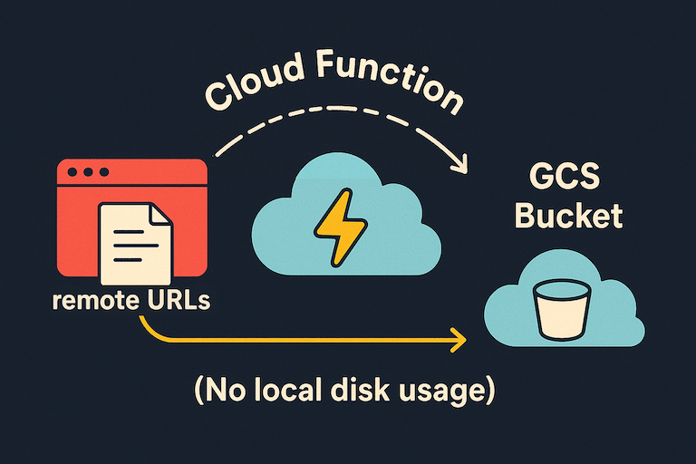
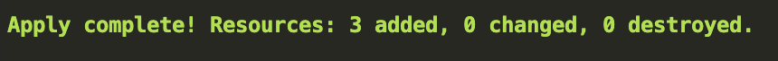

# Serverless loader: copy remote files directly into GCS



This project provisions GCS buckets and Cloud Run Functions by Terraform to load remote files directly into GCS from a given list of URLs, without storing them on a local disk.

## What it does

Downloads a list of URLs and writes them straight to your GCS bucket on GCP. Nothing is persisted on a local machine: no local disk usage, less time spent on intermediate copies.

## Use cases
- Process files later on GCP services
- Archive data in GCS without local copies
- One-off or recurring remote-to-GCS transfers

## Prerequisites

- Have access to a GCP project with sufficient IAM permissions for GCP Buckets and Cloud Run Functions. A trial account is sufficient for trying: `https://cloud.google.com/free`
- Install gcloud CLI: `https://cloud.google.com/sdk/docs/install-sdk`
- Install Docker Compose: `https://docs.docker.com/compose/install/`

## Setup

### 1) Clone and configure

```bash
git clone <your-fork-or-this-repo-url>
cd bucketloader
```

Fill in environment variables (used by Docker Compose):

1. Open `env.tmp` and set the path to your gcloud config (Linux/macOS default: `~/.config/gcloud`).
2. Save your changes, then move the file to the path expected by Docker:

```bash
mv env.tmp .env
```

Provide Terraform input variables:

1. Open `tfvars.tmp` in the repo root and replace placeholders (GCP project id, bucket name, region, etc.).
2. Move it into Terraform's expected filepath:

```bash
mv tfvars.tmp terraform/terraform.tfvars
```

Info: The paths `.env` and `terraform/terraform.tfvars` will be ignored by Git as the path is already added to .gitignore.

### 2) Start the Terraform container

```bash
docker compose up -d
```

Open a shell inside the running container:

```bash
docker exec -it terraform sh
```

If the next commands are not found immediately, `cd /workspace` inside the container and try again.

## Provision infrastructure and load files

Test the Terraform plan (no changes applied):

```sh
./engine/starter.sh test
```

Apply the plan to create the bucket and deploy the Cloud Run Function:

```sh
./engine/starter.sh apply
```

Resource creation typically takes ~1 minute. When done, you should see:



Exit the container when done:

```sh
exit
```

Prepare your URL list locally by editing `urls.txt` (one URL per line). Then start the loader from your terminal:

```bash
./load_to_bucket.sh
```

You can verify progress and results in the GCP Console once transfers begin.

## Managing secrets and environment variables

This repo ships `env.tmp` as a template you rename to `.env`. Instead of (or in addition to) that approach, you can use alternative methods that you prefer, but whichever method you choose, never commit secrets. If you do keep `.env`, always make sure it is in `.gitignore`.

## Notes

Note: This is a side project meant as a development practice; the GCP-native Storage Transfer Service provides agentless URL-to-GCS transfers and should be preferred for enterprise-grade production workloads.